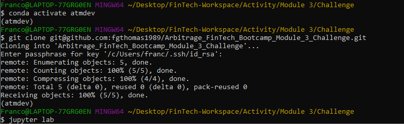

# Financial_Planning_API_Simulation_Module_5

___
The purpose of this project is to build a tool to help credit union members evaluate their financial health. Specifically, members of the credit union should be able to: 
1) Assess their monthly budgets, and 

2) Forecast a reasonably effective retirement plan based on their current holdings of cryptocurrencies, stocks, and bonds.

I will do this by creating two financial analysis tools by using a single Jupyter notebook:

1) A financial planner for emergencies - members will be able to use this tool to visualize their current savings. The members can then determine if they have enough reserves for an emergency fund.

2) A financial planner for retirement - this tool will forecast the performance of their retirement portfolio in 30 years. To do this, the tool will make an Alpaca API call via the Alpaca SDK to get historical price data for use in Monte Carlo simulations.

Finally, I will utilize the Monte Carlo simulation to answer questions about the portfolio in the Jupyter notebook.

---

## Technologies

This project leverages python 3.7 with various Libraries and IDE:

* [Jupyterlab](http://justinbois.github.io/bootcamp/2020_fsri/lessons/l01_welcome.html#Jupyter) - An interactive development environment

* [Pandas](https://www.w3schools.com/python/pandas/pandas_dataframes.asp) - A useful python library for analysis.

* [Numpy](https://www.w3schools.com/python/numpy/numpy_intro.asp) - A useful Python library for working with arrays.

* [Matplotlib](https://www.w3schools.com/python/matplotlib_intro.asp) - A useful python library for low level graph plotting that serves as a visualization utility.

* [Requests](https://requests.readthedocs.io/en/latest/) - The Python Requests library helps you access data via APIs.

* [JSON](https://www.json.org/json-en.html) - This library puts the response (that is, the data) from an API into a human-readable format.

* [Dotenv](https://pypi.org/project/python-dotenv/) - This enables storage of API keys and ensures that it is not shared publicly.

* OS - The OS module comes under Python's standard utility models and provides functions for interacting with the computer's operating system. The OS module does not require a separate download.

---

## Installation Guide

In order to run the application, one must first install the following dependencies.

* Install Alpaca Software Development Kit (SDK)

* Install Dotenv

* Install JSON

* Install Requests

* Open Jupyter Lab with Gitbash

---

## Usage
To use the analysis, clone the repository and run the financial_planning_tools.ipynb notebook within the Jupyter Notebook.

---

## Contributors

Brought to you by Franco Thomas via the Columbia Engineering FinTech Bootcamp.

Significant contributions made by subcontractors Professor Marghub Mirza, TA Ashfaque, and TA Boomin Kwon.

---

## License

MIT